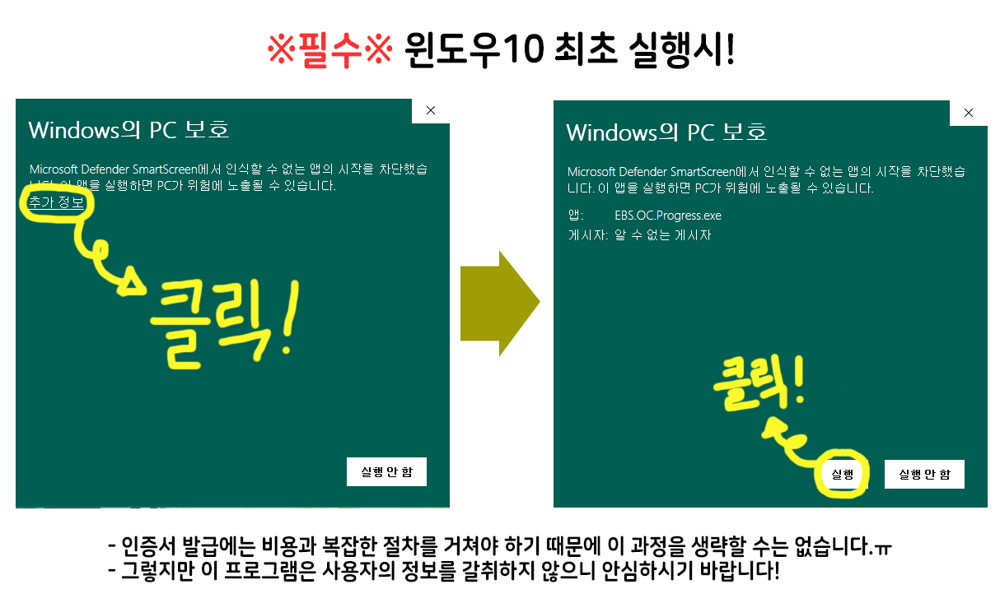
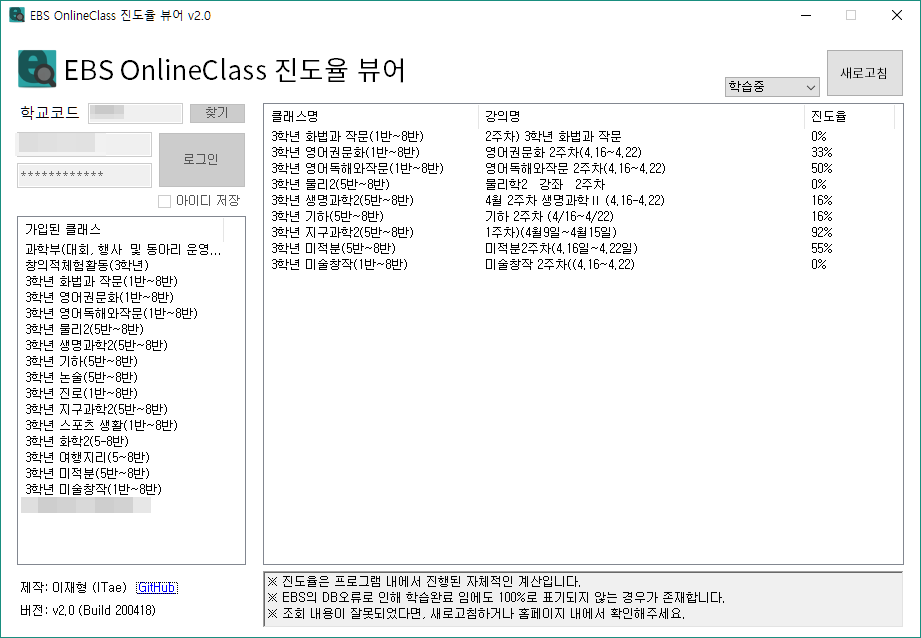

# EBS OC ProgressViewer
EBS 온라인 클래스 진도율을 일괄적으로 조회할 수 있는 프로그램입니다.  
진도율로 출결관리를 하는 학생들을 위해 제작되었습니다.  

### 최신버전 : v2.0

## [다운로드 (Download)](https://github.com/devITae/EBSOCProgressViewer/releases/download/2.0/EBSOCProgress2.0.exe)

#### VB .NET 으로 제작되었으며 윈도우에서만 이용가능 합니다.
#### EBS 계정으로만 로그인이 가능합니다. (소셜로그인 미지원)
#### 일부 학생들에게서 로그인이 되지 않는 오류가 보고되었습니다. 파악 중에 있습니다.
ChangeLog : https://github.com/devITae/EBSOCProgressViewer/releases  

# 1. 사용법
## 1.1. 학교코드 검색
0. "찾기" 버튼을 누릅니다.

1. 맨위 검색창에 학교 이름을 입력합니다.

2. 옆의 "검색" 버튼을 클릭합니다.

3. 자신의 학교 이름을 클릭합니다.

4. "선택하기" 버튼을 누르면 자동으로 코드가 입력됩니다.

## 1.2. 설명

0. "찾기" 버튼을 통해 학교를 검색하여 학교코드를 찾을 수 있습니다.  
EBS 서버가 불안정할 때 검색이 되지 않는 경우가 있습니다. 자세한 내용은 [아래참고](#22-100-이지만-표시가-되는-경우)

1. 클래스 목록에는 자신이 가입한 클래스**만** 표시됩니다.

2. 학습중/학습완료인 강의들의 목록를 조회할 수 있습니다.

3. 이 프로그램은 사용자의 개인정보를 탈취하지 않습니다. 소스코드를 참고해주세요. [아래참고](#3-소스코드)

4. 보안상 비밀번호 저장 기능은 지원하지 않습니다. (급하게 만드느라..)

5. EBS의 자체 오류로 가끔씩 뒤섞일 때가 있으니 이땐 새로고침 해주세요.

## 1.3 주의사항

1. 진도율은 프로그램 내에서 진행된 자체적인 계산입니다. (EBS가 더 이상 진도율을 제공하지 않음)

2. 조회 내용이 잘못되었다면, 새로고침하거나 홈페이지 내에서 확인해주세요.

3. EBS의 DB오류로 인해 학습완료 임에도 100%로 표기되지 않는 경우가 존재합니다.

4. 본 사항을 분명히 숙지하시고, 문제가 생기지 않도록 주의하시기 바랍니다.

# 2. EBS 자체 오류 보고
아래 사항들은 프로그램의 문제가 아닌 EBS OC 사이트 자체에서 발생하는 오류들입니다.

## 2.1. 학교코드 찾기
### 이 기능은 v2.0 이후로 지원하지 않습니다. 필요에 따라 추후 지원예정입니다.
EBS 서버가 불안정 할 때 학교코드 검색이 간혹가다 되지 않습니다. 그럴 때 쓰는 방법입니다.

1. <a href="https://oc.ebssw.kr/" target="_blank">https://oc.ebssw.kr/</a> 에 들어가서 자신의 학교를 선택하고 **학교가기**를 누릅니다.

	

2. 새로 접속된 페이지의 주소를 보면 아래와 같이 영어와 **숫자 5자리**가 보입니다.

	***schulCcode=00000***

	그 **숫자 5자리**가 바로 **학교코드** 입니다.
3. 이제 프로그램에서 학교코드를 칸에 기입해주세요! (자동저장 됩니다!)

	
	
4. 이제 로그인 하면 됩니다!

## 2.2. 학습완료 임에도 100%로 표기되지 않는 경우
EBS 사이트에서 발생한 오류이며 사이트에서도 동일하게 뜹니다.  
이 현상은 진도가 2개로 복제되어 생김으로 인해 발생하는데, 복제되어도 어느 걸로 듣던지 오직 하나의 항목만 학습완료로 인정되는 경우입니다.  

# 3. 소스코드
이 프로그램의 소스 코드를 공개하고 있으며, MIT License를 준수합니다.  
https://github.com/devITae/EBSOCProgressViewer/releases 에서 다운 받을 수 있습니다.  

직접 기능을 추가해보시나, 이 코드를 분석해보셔도 좋습니다.  

아마도 학교나 학생들에 따라 제각각의 오류가 보고될 것입니다.  
하지만 그만큼의 데이터 확보가 부족한 상황이니 양해바랍니다 ㅠ  

p.s. 본의 아니게 스파게티 코드가 된점 죄송합니다 흑흑..
