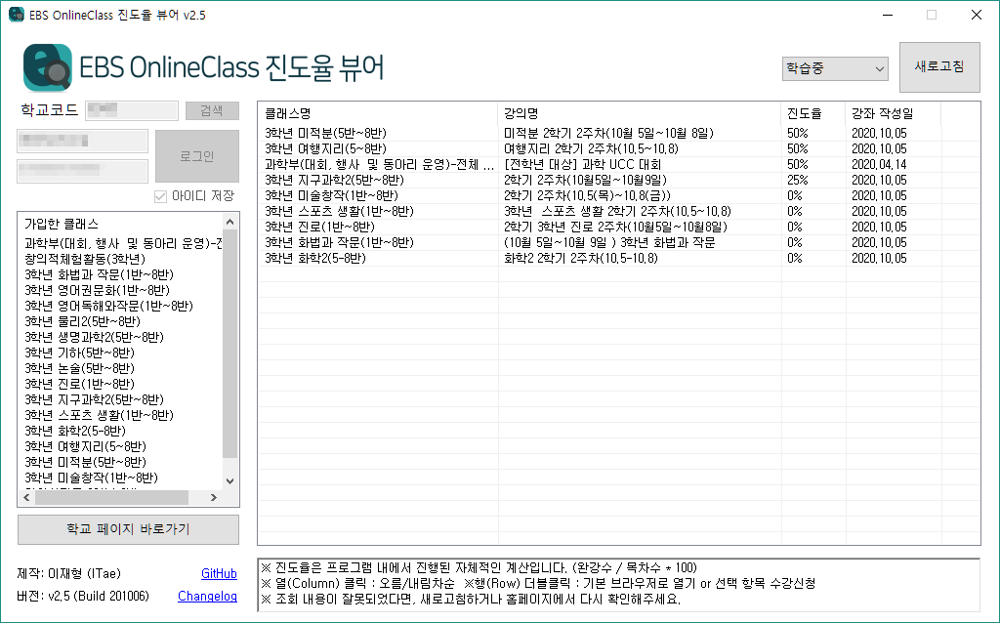

EBS 온라인 클래스 진도율을 일괄적으로 조회/계산할 수 있는 프로그램입니다.  
진도율로 출결관리를 하는 학생들을 위해 제작되었습니다.  (구. EBS 온라인 클래스 진도율 계산기)  
일괄 수강신청 기능, 학교 페이지 바로가기 등 여러 추가기능 또한 지원합니다.

### 최신버전 : v2.5 (Build 201006)

## [▷다운로드 (Download)](https://github.com/devITae/EBSOCProgressViewer/releases/download/2.5/EBSOCPro2.5.exe) [사용 전 아래 사항을 참고하세요!]

#### 윈도우에서만 사용가능 하며, 디스플레이 기본 배율(100%)에 최적화 되었습니다.
#### EBS 계정으로만 로그인이 가능합니다. (소셜로그인 미지원)

ChangeLog : https://github.com/devITae/EBSOCProgressViewer/releases  

# 1. 사용법
## 1.1. 학교코드 검색
0. "찾기" 버튼을 누릅니다.

1. 맨위 검색창에 학교 이름을 입력합니다.

2. 옆의 "검색" 버튼을 클릭합니다.  
(EBS 서버가 원활하지 않으면 작동하지 않는 경우가 있습니다.)  

3. 자신의 학교 이름을 클릭합니다.

4. "선택하기" 버튼을 누르면 자동으로 코드가 입력됩니다.

## 1.2. 설명

0. "찾기" 버튼을 통해 학교를 검색하여 학교코드를 찾을 수 있습니다.  
EBS 서버가 불안정할 때 검색이 되지 않는 경우가 있습니다.

1. 클래스 목록에는 자신이 가입한 클래스**만** 표시됩니다.

2. 학습중/학습완료/미수강중인 강의들의 목록를 조회할 수 있습니다.

3. 열(Column) 부분을 클릭하면 **오름/내림차순** 정렬이 가능합니다.

4. 행(Row) 부분을 **더블클릭**하면 해당 주소가 기본 브라우저로 열립니다. (클래스, 강의목록 모두 해당)

5. 미수강중 목록에서 **Ctrl, Shift, 드래그**를 활용해 다중 선택한 뒤 체크박스를 누르면 한번에 체크가 됩니다.  
개별 항목을 **더블클릭** 할 시, 선택한 항목만 수강신청 여부 메세지가 표시됩니다.

5. **이 프로그램은 사용자의 개인정보를 탈취하지 않습니다.** 소스코드를 참고해주세요. [아래참고](#3-소스코드)

6. 보안 상 비밀번호 저장 기능은 지원하지 않습니다. (급하게 만드느라..)

## 1.3 주의사항

1. 진도율은 프로그램 내에서 진행된 자체적인 계산입니다. (EBS가 더 이상 마이페이지 진도율을 제공하지 않음)  
※ 진도율 계산식 : (완료한 강의 수) / (해당강의 목차 수) * 100

2. 조회 내용이 잘못되었다면, 새로고침하거나 홈페이지 내에서 확인해주세요.  
하지만 아마도 높은 확률로 잘못 출력되지는 않을 것입니다.

3. ~~EBS의 DB오류로 인해 학습완료 임에도 100%로 표기되지 않는 경우가 존재합니다.~~  
#### 본 오류는 현재 수정되었습니다. [아래참고](#22-학습완료-임에도-100로-표기되지-않는-경우)

4. 본 사항을 분명히 숙지하시고, 문제가 생기지 않도록 주의하시기 바랍니다.

# 2. EBS 자체 오류 보고
아래 사항들은 프로그램의 문제가 아닌 EBS OC 사이트 자체에서 발생하는 오류들입니다.

## 2.1. ~~학교코드 찾기~~
### 이 기능은 v2.0 이후로 지원하지 않습니다. 필요에 따라 추후 지원예정입니다.
EBS 서버가 불안정 할 때 학교코드 검색이 간혹가다 되지 않습니다. 그럴 때 쓰는 방법입니다.

1. <a href="https://oc.ebssw.kr/" target="_blank">https://oc.ebssw.kr/</a> 에 들어가서 자신의 학교를 선택하고 **학교가기**를 누릅니다.

	

2. 새로 접속된 페이지의 주소를 보면 아래와 같이 영어와 **숫자 5자리**가 보입니다.

	***schulCcode=00000***

	그 **숫자 5자리**가 바로 **학교코드** 입니다.
3. 이제 프로그램에서 학교코드를 칸에 기입해주세요! (자동저장 됩니다!)

	

4. 이제 로그인 하면 됩니다!

## 2.2. ~~학습완료 임에도 100%로 표기되지 않는 경우~~
### 본 오류는 현재 수정되었습니다.
과거에 EBS 사이트에서 발생한 오류이며 사이트에서도 동일하게 뜹니다.  
이 현상은 DB상에서 진도가 2개로 복제되어 생김으로 인해 발생하는데, 복제되어도 어느 걸로 듣던지 오직 하나의 항목만 학습완료로 인정되는 경우입니다.  
현재는 DB 오류가 수정된 것을 확인하였습니다.

# 3. 소스코드
이 프로그램의 소스 코드를 공개하고 있으며, MIT License를 준수합니다.  
https://github.com/devITae/EBSOCProgressViewer/releases 에서 다운 받을 수 있습니다.  

직접 기능을 추가해보시나, 이 코드를 분석해보셔도 좋습니다.  

아마도 학교나 학생들에 따라 제각각의 오류가 보고될 것입니다.  
하지만 그만큼의 데이터 확보가 부족한 상황이니 양해바랍니다 ㅠ  

p.s. 본의 아니게 스파게티 코드가 된점 죄송합니다 흑흑..
